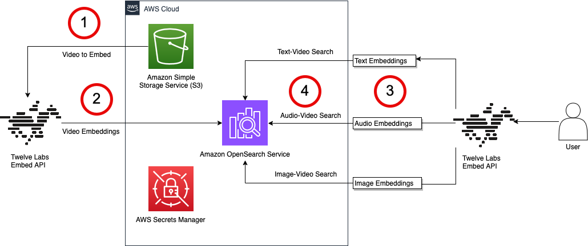

# Optimizing Multimodal Search Using the TwelveLabs Embed API and Amazon OpenSearch Service

This solution implements advanced video search capabilities by combining TwelveLabs Embed API with Amazon OpenSearch Service. This integration enables sophisticated multimodal search across video content using AI-powered video understanding and vector search capabilities.

**Disclaimer:** Sample code, software libraries, command line tools, proofs of concept, templates, or other related technology are provided as AWS Content or Third-Party Content under the AWS Customer Agreement, or the relevant written agreement between you and AWS (whichever applies). You should not use this AWS Content or Third-Party Content in your production accounts, or on production or other critical data. You are responsible for testing, securing, and optimizing the AWS Content or Third-Party Content, such as sample code, as appropriate for production grade use based on your specific quality control practices and standards. Deploying AWS Content or Third-Party Content may incur AWS charges for creating or using AWS chargeable resources, such as running Amazon EC2 instances or using Amazon S3 storage. This application uses various AWS services and there are costs associated with these services after the Free Tier usage - please see the AWS Pricing page for details. You are responsible for any AWS costs incurred. No warranty is implied in these examples.

## Overview

This project demonstrates how to:
- Generate rich vector embeddings from video content using the Embed API
- Store and index video embeddings in Amazon OpenSearch Service
- Perform multimodal semantic search across video libraries
- Enable sophisticated video discovery and analysis

#### Architecture Overview 

The following diagram provides an overview of the architecture and the steps followed to 
1. A video file is stored in Amazon Simple Storage Service (Amazon S3). Embeddings of the video file are created using the Embed API.
2. Embeddings generated from the Embed API are now ingested to Amazon OpenSearch Service.
3. The user can search their video content using text, audio, or image queries. The user uses Embed API to create the corresponding embeddings.
4. The user searches video embeddings in Amazon OpenSearch Service and retrieves the corresponding vector.

## Features

- **Multimodal Video Understanding**
  - Video processing
  - Generation of 1024-dimensional vector embeddings

- **Advanced Search Capabilities** 
  - Semantic search using text queries
  - Visual similarity search
  - Combined multimodal search

- **Scalable Architecture**
  - Deployment with Amazon OpenSearch Service on AWS
  - Vector storage and indexing with Amazon OpenSearch Service
  - Integration with TwelveLabs

## Prerequisites
  - Confirm that you have an [AWS account](https://docs.aws.amazon.com/accounts/latest/reference/manage-acct-creating.html)
  - Create a [TwelveLabs account](https://auth.twelvelabs.io/u/signup/) as it will be required to get the API Key. TwelveLabs offers a free tier [pricing](https://www.twelvelabs.io/pricing) but you can upgrade as per your requirement.
  - Confirm that you have an Amazon OpenSearch Service domain. If you do not have an existing domain, you can create one using the steps outlined in our public documentation for [Creating and Managing Amazon OpenSearch Domain](https://docs.aws.amazon.com/opensearch-service/latest/developerguide/createupdatedomains.html). Ensure that OpenSearch Service domain is accessible from your Python environment. You can also use [Amazon OpenSearch Serverless](https://docs.aws.amazon.com/opensearch-service/latest/developerguide/serverless.html) for this use case and update the interactions to OpenSearch serverless using [AWS SDKs](https://docs.aws.amazon.com/opensearch-service/latest/developerguide/serverless-sdk.html).

## Running the notebook
Execute the steps in the `TwelveLabs_OpenSearch.ipynb` notebook to create embeddings and perform searches.

## Authors
Contributor names and info

  - James Le, Head of Developer Experience, TwelveLabs
  - Gitika Vigh, Senior WW Data & AI PSA, AWS
  - Kruthi Rao, Senior PSA, AWS
    
## License
Copyright 2024 Amazon.com, Inc. or its affiliates. All Rights Reserved.

This library is licensed under the MIT-0 License. See the LICENSE file.

